# Understanding Transformers for Bot Detection in Twitter
This repository includes full-size images, tables and jupyter notebooks with the experiments reported in the paper **Understanding Transformers for Bot Detection in Twitter** submitted for revision to **Coling'2020**. The following subjects presented in the paper are covered here:

  * [Fine-tuning language models on bot detection](#fine-tuning-language-models-on-bot-detection)
  * [Vocabulary and word embeddings](#vocabulary-and-word-embeddings)
  * [Exploring hidden states](#exploring-hidden-states)
    + [Grammatical analysis](#grammatical-analysis)
    + [Contextual Similarity](#contextual-similarity)
    + [Twitter Entities](#twitter-entities)

## Fine-tuning language models on bot detection
We fine-tune BERT base, GPT and GPT2 (117M model) on the bot detection task using different models and libraries available. 

<p align="center">
  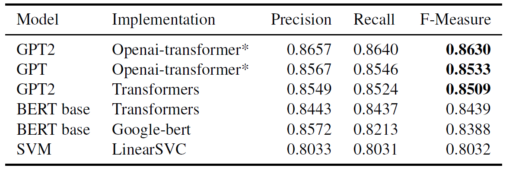</br>
  Evaluation of fine-tuned language models on the bot detection task. (*) modified version of the original implementation for the classification task.  As reference we trained an SVM classifier using alinear kernel (Fan et al., 2008) where the regularization parameter was adjusted using grid search andwords were lemmatized using wordnet and stopwords removed.
</p>

In addition, we fine-tuned BERT and GPT2 to spot entities such as user names, hashtags and urls in tweets. 
 
<p align="center">
  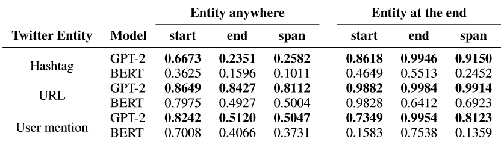</br>
  F-measure of the fine-tuned language models to spot twitter entities.
</p>

Related Notebooks: 
* [bot_detection-GPT2-OpenAI.ipynb](./bot_detection/bot_detection-GPT2-OpenAI.ipynb) finetunes OpenAI GPT2 on the bot detection task, based on a [implementation for OpenAI GPT](https://github.com/tingkai-zhang/pytorch-openai-transformer_clas/).
* [bot_detection-GPT2-OpenAI-results.ipynb](./bot_detection/bot_detection-GPT2-OpenAI-results.ipynb) notebook to evaluate the predictions of the previous notebook.
* [bot_detection-BERT_GPT2-transformers.ipynb](./bot_detection/bot_detection-BERT_GPT2-transformers.ipynb) finetunes BERT or GPT2 using [transformers library](https://huggingface.co/transformers/).
* [bot_detection-SVM-LinearSVC.ipynb](./bot_detection/bot_detection-SVM-LinearSVC.ipynb) trains a SVM to classify on the bot detection task.
* [finding_tokens_anywhere-GPT2.ipynb](./finding_tokens/finding_tokens_anywhere-GPT2.ipynb) trains GPT2 to find twitter entities anywhere in a tweet.
* [finding_tokens_anywhere-BERT.ipynb](./finding_tokens/finding_tokens_anywhere-BERT.ipynb) trains BERT to find twitter entities anywhere in a tweet.
* [finding_tokens_end-GPT2.ipynb](./finding_tokens/finding_tokens_end-GPT2.ipynb) trains GPT2 to find twitter entities at the end of a tweet.
* [finding_tokens_end-BERT.ipynb](./finding_tokens/finding_tokens_end-BERT.ipynb) trains BERT to find twitter entities at the end of a tweet.

## Vocabulary and word embeddings
In the following charts we show the word lenght distribution in terms of number of tokens (subwords units) for words in our dataset of tweets and also for words in the Corpus of Linguistic Acceptability (CoLA) and the Stanford Sentiment Tree Bank (SST2) that are part of the GLUE benchmark: 

| 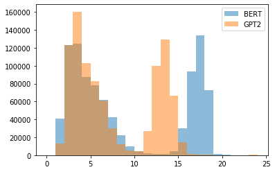<p align="center">Bot detection</p>  | 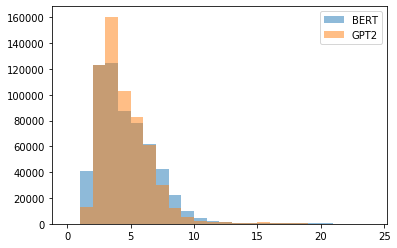<p align="center">Bot detection without URLs</p> | 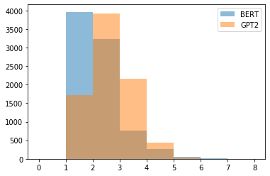<p align="center">CoLA</p> | 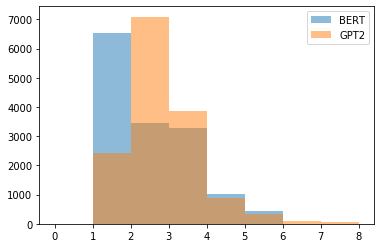<p align="center">SST2</p> |
|:---:|:---:|:---:|:---:|
<p align="center">Word length distribution (# tokens) on the bot detection, CoLA, and SST2 datasets.</p>


We trained softmax classifiers for bot detection using the embeddings learned by the fine-tuned models. In addition, we use embeddings of the fine-tuned models on different tasks in GLUE and trained classifiers for their own tasks: the Corpus of Linguistic Acceptability (CoLA),  Stanford Sentiment Tree Bank (SST2), the Quora Question Pairs (QQP), and the Microsoft Research Paraphrase Corpus (MRPC)

<p align="center">
  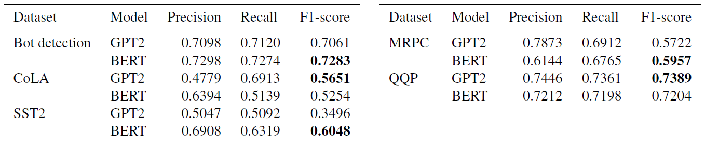</br>
  Embeddings performance in different datasets (fine-tuned models in the corresponding task)
</p>

Related Notebooks: 
* [word_size-BERT_GPT2.ipynb](./vocabulary_analysis/word_size-BERT_GPT2.ipynb) tokenizes different datasets (bot detection, SST2, CoLA) to compare BERT and GPT2 tokenization.
* [bot_detection_embeddings-BERT_GPT2.ipynb](./word_embeddings/bot_detection_embeddings-BERT_GPT2.ipynb) trains a linear layer with the concatenation of all the embeddings of a sentence in the bot detection task.
* [CoLA_embeddings-GPT2.ipynb](./word_embeddings/CoLA_embeddings-GPT2.ipynb) trains a linear layer with the concatenation of all the GPT2 embeddings of a sentence in the CoLA task.
* [CoLA_embeddings-BERT.ipynb](./word_embeddings/CoLA_embeddings-BERT.ipynb) trains a linear layer with the concatenation of all the BERT embeddings of a sentence in the CoLA task.
* [SST2_embeddings-GPT2.ipynb](./word_embeddings/SST2_embeddings-GPT2.ipynb) trains a linear layer with the concatenation of all the GPT2 embeddings of a sentence in the SST-2 task.
* [SST2_embeddings-BERT.ipynb](./word_embeddings/SST2_embeddings-BERT.ipynb) trains a linear layer with the concatenation of all the BERT embeddings of a sentence in the SST-2 task.
* [MPRC_embeddings-GPT2.ipynb](./word_embeddings/MPRC_embeddings-GPT2.ipynb) trains a linear layer with the concatenation of all the GPT2 embeddings of a sentence in the MRPC task.
* [MPRC_embeddings-BERT.ipynb](./word_embeddings/MPRC_embeddings-BERT.ipynb) trains a linear layer with the concatenation of all the BERT embeddings of a sentence in the MRPC task.
* [QQP_embeddings-GPT2.ipynb](./word_embeddings/QQP_embeddings-GPT2.ipynb) trains a linear layer with the concatenation of all the GPT2 embeddings of a sentence in the QQP task.
* [QQP_embeddings-BERT.ipynb](./word_embeddings/QQP_embeddings-BERT.ipynb) trains a linear layer with the concatenation of all the BERT embeddings of a sentence in the QQP task.

## Exploring hidden states
We use the hidden states of the `<CLS>` token for BERT, and the last token in the sequence for GPT2 as input to a softmax classifier for bot detection and the following GLUE tasks: Corpus of Linguistic Acceptability (CoLA), with sentences from the linguistic literature domain, Stanford Sentiment Tree Bank (SST2) that includes movie reviews, Quora Question Pairs (QQP) and the Microsoft Research Paraphrase Corpus (MRPC). Next, we plot the f-measure of the trained classifiers using the hidden states (Click the image to enlarge): 
 

| 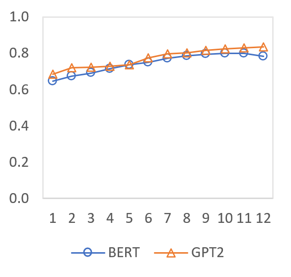<p align="center">Bot detection</p>  | 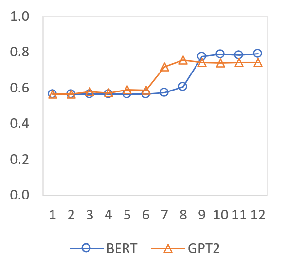<p align="center">CoLA</p> | 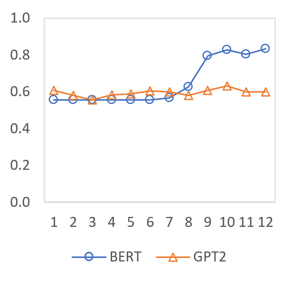<p align="center">MRPC</p> | 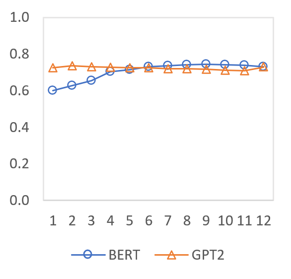<p align="center">QQP</p> | 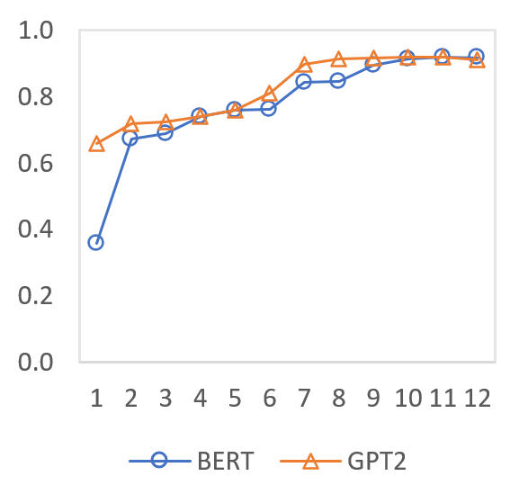<p align="center">SST-2</p> |
|:---:|:---:|:---:|:---:|:---:|
<p align="center">Layer analysis of BERT and GPT2 fine-tuned on bot detection, CoLA, MRPC, QQP and SST-2</p>

Related Notebooks: 
* [bot_detection_multiple_layer-BERT.ipynb](./hidden_states/bot_detection_multiple_layer-BERT.ipynb) trains multiple linear layers with BERT embeddings at different layer levels, in the bot detection task.
* [bot_detection_multiple_layer-GPT2.ipynb](./hidden_states/bot_detection_multiple_layer-GPT2.ipynb) trains multiple linear layers with GPT2 embeddings at different layer levels, in the bot detection task.
* [CoLA_multiple_layer-BERT.ipynb](./hidden_states/CoLA_multiple_layer-BERT.ipynb) trains multiple linear layers with BERT embeddings at different layer levels, in the CoLA task.
* [CoLA_multiple_layer-GPT2.ipynb](./hidden_states/CoLA_multiple_layer-GPT2.ipynb) trains multiple linear layers with GPT2 embeddings at different layer levels, in the CoLA task.
* [MPRC_multiple_layer-BERT.ipynb](./hidden_states/MPRC_multiple_layer-BERT.ipynb) trains multiple linear layers with BERT embeddings at different layer levels, in the MRPC task.
* [MPRC_multiple_layer-GPT2.ipynb](./hidden_states/MPRC_multiple_layer-GPT2.ipynb) trains multiple linear layers with GPT2 embeddings at different layer levels, in the MRPC task.
* [QQP_multiple_layer-BERT.ipynb](./hidden_states/QQP_multiple_layer-BERT.ipynb) trains multiple linear layers with BERT embeddings at different layer levels, in the QQP task.
* [QQP_multiple_layer-GPT2.ipynb](./hidden_states/QQP_multiple_layer-GPT2.ipynb) trains multiple linear layers with GPT2 embeddings at different layer levels, in the QQP task.
* [SST2_multiple_layer-BERT.ipynb](./hidden_states/SST2_multiple_layer-BERT.ipynb) trains multiple linear layers with BERT embeddings at different layer levels, in the SST-2 task.
* [SST2_multiple_layer-GPT2.ipynb](./hidden_states/SST2_multiple_layer-GPT2.ipynb) trains multiple linear layers with GPT2 embeddings at different layer levels, in the SST-2 task.


### Grammatical analysis
We investigate the representation of grammatical information in the pre-trained models and their fine-tuned versions on the bot detection task. We look into the hidden states representation of part-of-speech tags and chunks. We use Tweet NLP POS tagger to annotate our dataset with common word categories such as nouns and verbs and twitter-specific tags like hashtags and emoticons. For chunks we use the CONLL-2000 dataset released for the chunking task. In the following we plot the NMI values calculated out the clusters obtained using k-means on the hidden states and outputs of the language models: 

| 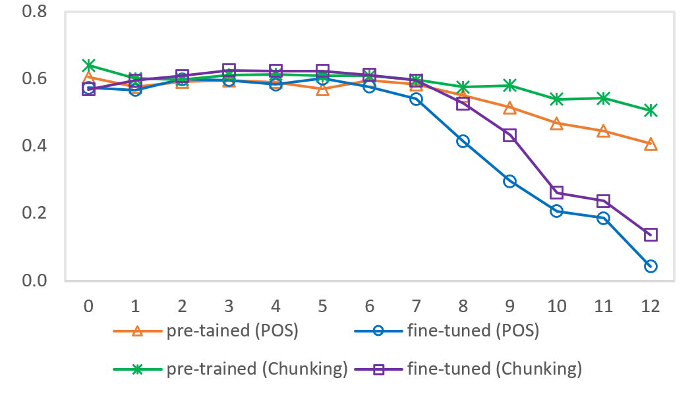<p align="center">BERT</p>  | 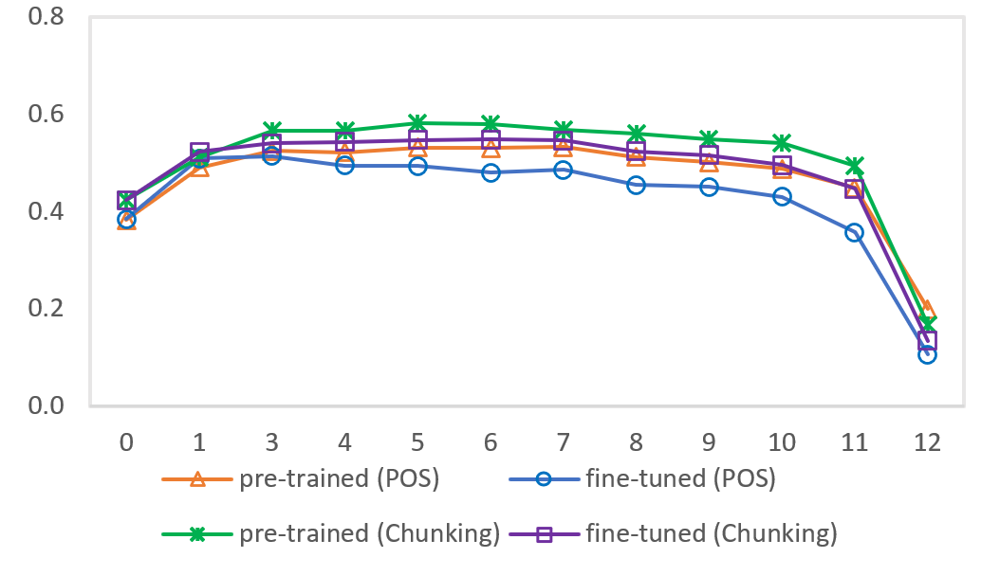<p align="center">GPT2</p> |
|:---:|:---:|

<p align="center">
  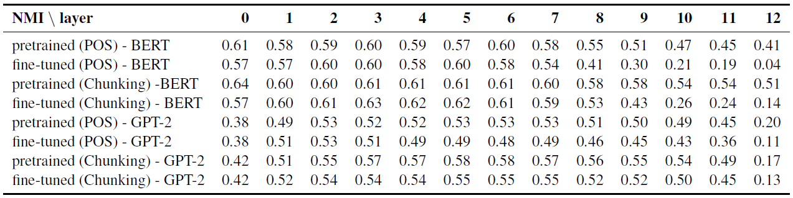</br>
  NMI of the hidden state clusters and part-of-speech tags and chunk labels.  We compare the pre-trained language models and fine-tuned models in the bot detection task.
</p>

Related Notebooks: 
* [POS-BERT_pretrained.ipynb](./grammatical_analysis/POS-BERT_pretrained.ipynb) evaluates different layer pretrained BERT embeddings for part-of-speech tagging.
* [POS-BERT_finetuned.ipynb](./grammatical_analysis/POS-BERT_finetuned.ipynb) evaluates different layer finetuned BERT embeddings for part-of-speech tagging.
* [chunking-BERT_pretrained.ipynb](./grammatical_analysis/chunking-BERT_pretrained.ipynb) evaluates different layer pretrained BERT embeddings for chunking.
* [chunking-BERT_finetuned.ipynb](./grammatical_analysis/chunking-BERT_finetuned.ipynb) evaluates different layer finetuned BERT embeddings for chunking.
* [POS-GPT2_pretrained.ipynb](./grammatical_analysis/POS-GPT2_pretrained.ipynb) evaluates different layer pretrained GPT2 embeddings for part-of-speech tagging.
* [POS-GPT2_finetuned.ipynb](./grammatical_analysis/POS-GPT2_finetuned.ipynb) evaluates different layer finetuned GPT2 embeddings for part-of-speech tagging.
* [chunking-GPT2_pretrained.ipynb](./grammatical_analysis/chunking-GPT2_pretrained.ipynb) evaluates different layer pretrained GPT2 embeddings for chunking.
* [chunking-GPT2_finetuned.ipynb](./grammatical_analysis/chunking-GPT2_finetuned.ipynb) evaluates different layer finetuned GPT2 embeddings for chunking.

### Contextual Similarity
We calculated the average cosine similarty between the hidden states and outputs of the language models for all the tokens in a tweet (intra-sentence similarity). The following visualization shows the cosine similarity for the tweet `Congratulations @LeoDiCaprio \#Oscars https://t.co/5WLesgfnbe` using the representations generated by the pre-trained and fine-tuned language models:

| 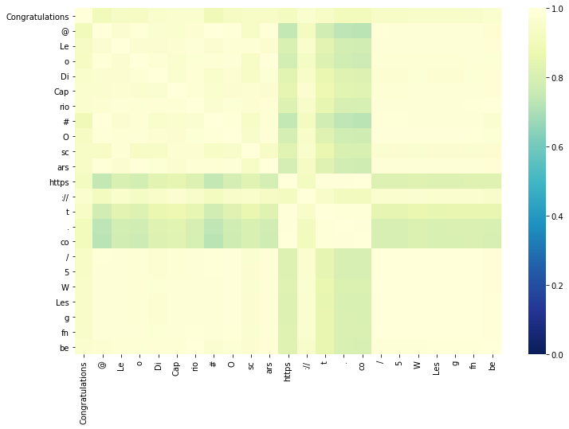<p align="center">GPT2 pre-trained</p>  | 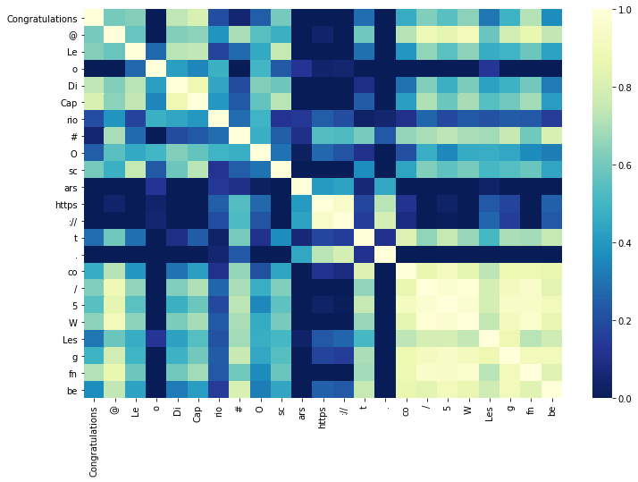<p align="center">GPT2 fine-tuned</p> |
|:---:|:---:|
| 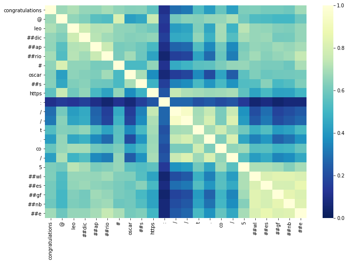<p align="center"><b>BERT pre-trained</b></p>  | 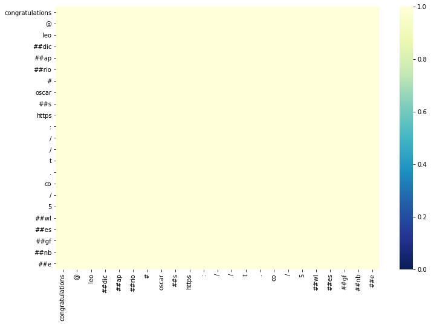<p align="center"><b>BERT fine-tuned</b></p> |

<p align="center">
 Contextual similarity of all words and sub-word units pairs in a tweet computed out of the language model output representations of the pre-trained and fine-tuned models.
</p>

To investigate whether the above pattern generalizes we calculate the average intra-sentence cosine similarity for 100.000 tweets. The following chart shows this similarity calculated for the hidden states and outputs of the pretrained and fine-tuned language models:

<p align="center">
 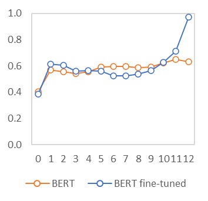
 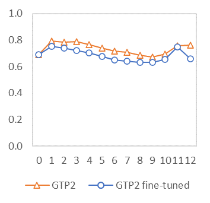</br>
 Average intra-sentence contextual similarity.
</p>

Related Notebooks: 
* [contextual_simillarity_BERT_GPT2.ipynb](./contextual_similarity/contextual_simillarity_BERT_GPT2.ipynb) visualization of the intra-sentence contextual similarity for BERT and GPT2.
* [contextual_simillarity_generalization-BERT_GPT2.ipynb](./contextual_similarity/contextual_simillarity_generalization-BERT_GPT2.ipynb) calculates the average intra-sentence contextual similiarity for each model (BERT or GPT2) layer.

## Twitter entities 
We also analyze how the language models represent twitter entities since they show a different usage pattern by bots and humans. We use k-means to obtain clusters out of the hidden states and outputs corresponding to twitter entities in our dataset. The following charts shows the NMI values for the clusters obtained for BERT and GPT2: 

 <p align="center">
 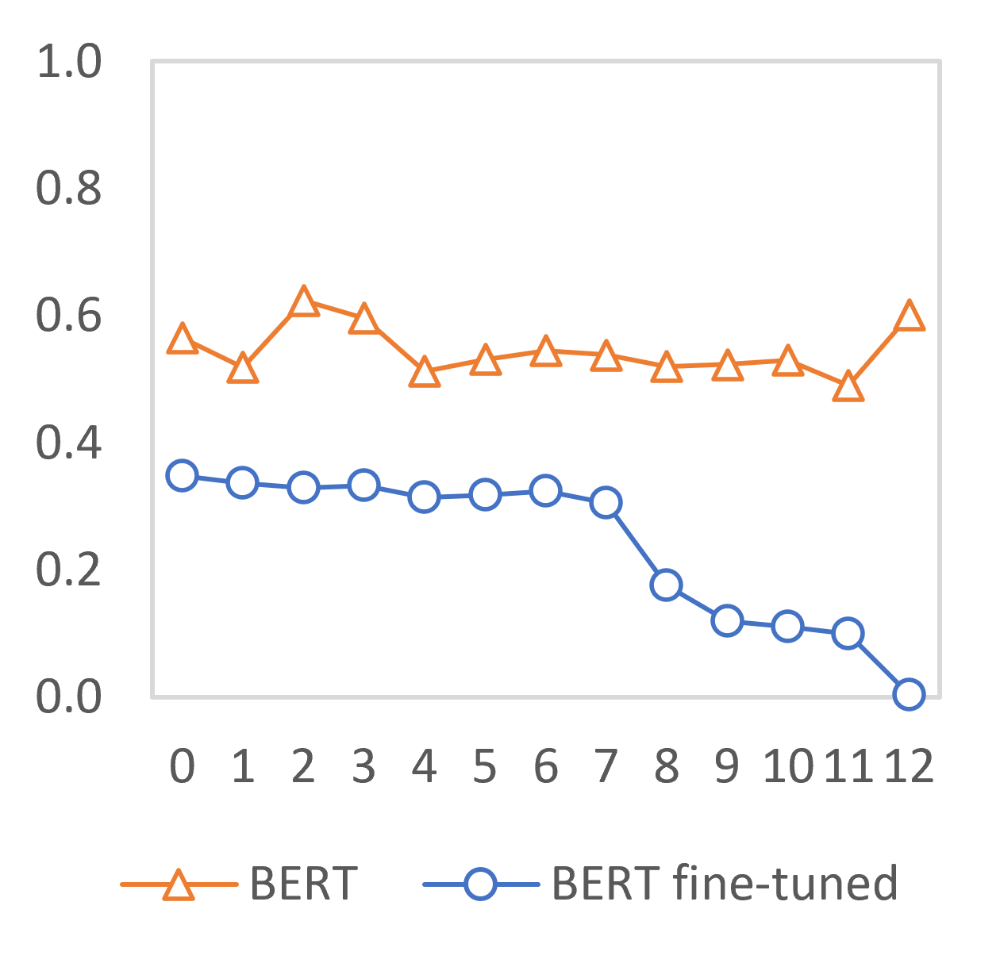
 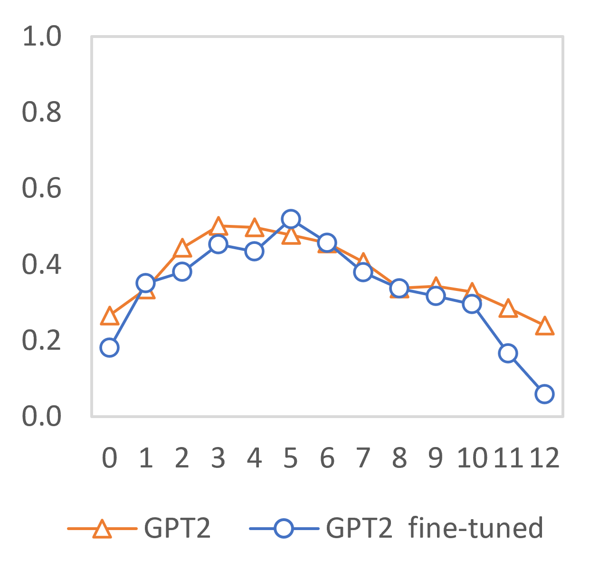</br>
 NMI evaluation of contextual representation clusters for twitter entities.
</p>

Related Notebooks: 
* [twitter_entities-BERT.ipynb](./twitter_entities/twitter_entities-BERT.ipynb) evaluates different layer BERT embeddings for twitter entity (user, hashtag, URL or other) identification.
* [twitter_entities-GPT2.ipynb](./twitter_entities/twitter_entities-GPT2.ipynb)  evaluates different layer GPT2 embeddings for twitter entity (user, hashtag, URL or other) identification.

# How to generate the dataset?
Although the human and bot twitter account dataset is not longer available from the [original source](https://www.cl.cam.ac.uk/~szuhg2/data/characterisation_processed.zip), it can be found [here](./dataset_generation/classification_processed).

We need to create two datasets, one with tweets made by human accounts, and one with tweets made by bot accounts. To download tweets from Twitter, we are going to use the [twitter API](https://developer.twitter.com/en/docs), and to make things more easily, we are going to use the [Twitter Ruby Gem](https://rdoc.info/gems/twitter). To use this library we need to install [ruby](https://www.ruby-lang.org/en/), [Twitter Ruby Gem](https://rdoc.info/gems/twitter) and the [csv gem](https://github.com/ruby/csv).

Last step before launching the scripts is to get [Twitter Consumer API keys](https://developer.twitter.com/en/docs/basics/authentication/overview/application-only). Once we have download the twitter human and bot account dataset, installed ruby, and the required ruby gems, and get our Twitter Consumer API keys, we can edit the program-bots.rb and program-humans.rb, set the config.consumer_key and config.consumer_secret variables with your Twitter consumer API keys, and run the scripts with, they are found in the [dataset generation](./dataset_generation) folder: 

```
ruby program-bots.rb
ruby program-humans.rb
```
Please be aware that the scripts are expecting the "classification_processed" folder to be in the same folder. 

If everything is fine, two CSV files containing human and bot tweets will be generated 'tweets-humans.csv' and 'tweets-bots.csv'.

We created the training and test datasets joining both human and bot tweet datasest in one dataset, taking a random sample of 500000 tweets for training and 100000 random tweets for testing. The code can be found at [Generate_human_and_bots_tweets_dataset.ipynb](./dataset_generation/Generate_human_and_bots_tweets_dataset.ipynb). This notebook can be imported in [Google Colab](https://colab.research.google.com), and can be runned from there if you want. You need to upload the 'tweets-humans.csv' and 'tweets-bots.csv' into Google Drive.

If you need the dataset that we used in our experiments, please contact us at <botonobot@gmail.com>.

# Dependencies
To run the experiments in the different notebooks, you need to install the following libraries:
* numpy
* pytorch (cudatoolkit=9.2)
* keras
* transformers (v2.1.1)
* pandas
* scikit-learn 
* ftfy
* spacy
* nltk
* matplotlib

It is recommended to install [Anaconda](https://www.anaconda.com/products/individual), and to create an enviroment to have all the libraries in the same place.
To run the notebooks, you need to install jupyter-notebook or [JupyterLab](https://jupyter.org/install.html). Please be aware that some experiments will take a  while in a CPU, so it is highly recommended to use a CUDA comapatible GPU to run some of the experiments.
